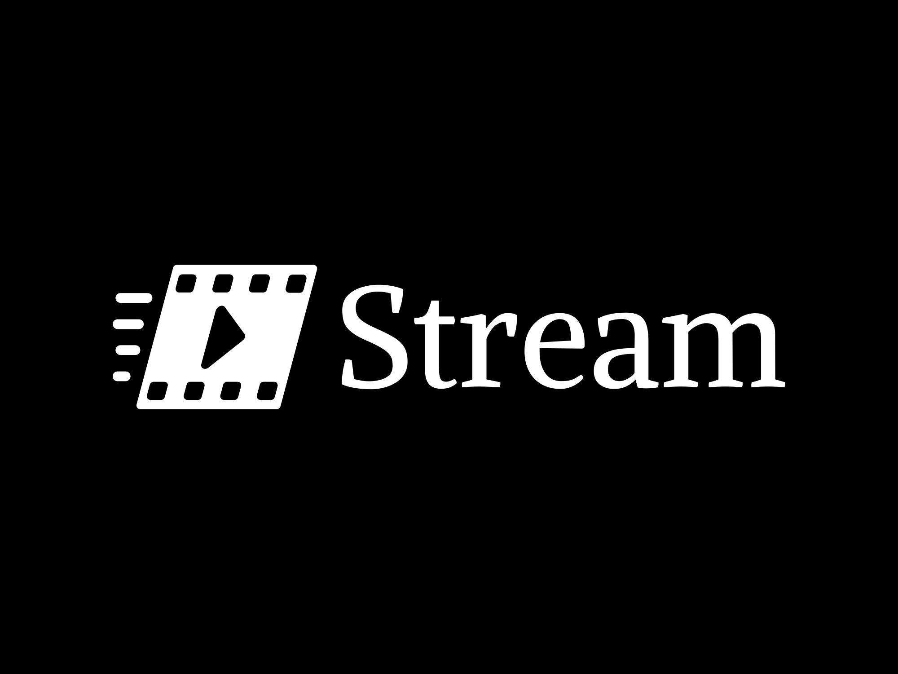

# Stream (A Netflix Clone)

Stream is an online film/series details display created to mimic the dynamic User Interface of the popular online streaming platform, Netflix. This project aims to provide a robust and visually appealing platform for browsing and discovering films and series, simulating the experience of using Netflix.

## Project Purpose and Goals

The main goal of Stream is to replicate the Netflix UI to offer users a seamless and engaging way to explore media content. It serves as a practical project to demonstrate skills in modern web development, particularly using React, TypeScript, and other related technologies.

## Features

- **Dynamic User Interface**: A highly responsive and interactive UI similar to Netflix.
- **Media Details**: Detailed information for each film or series, including genres, ratings, and descriptions.
- **Search Functionality**: Ability to search for films and series by name.
- **Category Browsing**: Browse media content by various categories and genres.
- **User Authentication**: Capability to create a sub-user to add films/series to user watch lists.

## Tech Stack

This application was created utilizing the following tech stack:
|User Interface  | API interactions |Design| Testing |
|----------------|------------------|------|-------|
|Vite         | Axios            |Figma |Jest (Unit and Integration)|
|React TypeScript| TMDB API         |React-BootStrap | Cypress (E2E)|
|React-Router-DOM|                  |TailwindCSS|                   |

            

## License

This project is licensed under the MIT License - see the [LICENSE](LICENSE) file for details.

